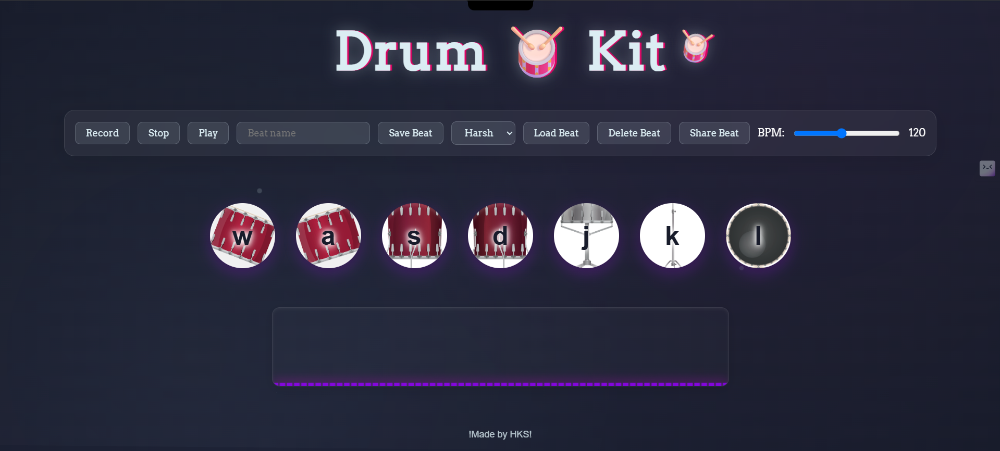

# 🥁 Drum Kit Web App

A dynamic, browser-based drum machine built with **vanilla JavaScript**, **HTML**, and **CSS**, powered by the **Web Audio API**, **Canvas API**, and integrated with **Firebase** for cloud-based beat sharing.

---

## 🚀 Live Demo

> 🎧 [Try it out here!](https://drumkit-12a38.web.app/)

---

## 📌 Features

- 🎙 **Record & Playback**: Create custom drum sequences using your keyboard.
- 💾 **Save, Load, & Delete Beats**: Store your beats in the cloud using Firebase Firestore.
- 🔗 **Share via URL**: Generate shareable links to your beats using Firebase document IDs.
- ⚡ **Dynamic BPM Control**: Adjust tempo in real-time.
- 👀 **Live Visualizer**: Interactive sound wave display built with the Canvas API.
- 🛠 **Multiple Drum Sounds**: Responsive keys (W, A, S, D, J, K, L) mapped to different drum elements.

---

## 🛠 Tech Stack

| Technology               | Purpose                                                |
| ------------------------ | ------------------------------------------------------ |
| **HTML/CSS**             | UI structure and styling                               |
| **JavaScript (Vanilla)** | Core interaction logic                                 |
| **Web Audio API**        | Handling sound playback and recording                  |
| **Canvas API**           | Creating the visual waveform effects                   |
| **Firebase**             | Backend for storing beats and enabling shareable links |
| **Cloud Concepts**       | Used to design persistent, URL-based data access       |

---

## 📚 Background

This project began as part of the **Angela Yu Web Development Bootcamp** on Udemy, where the basic interactive drum kit was built. Since then, I’ve **upgraded** the app by integrating:

- 🔄 Cloud storage and retrieval using **Firebase Firestore**
- 🌐 Shareable URLs using **Firebase document references**
- 🎨 An animated beat visualizer with the **Canvas API**

These enhancements apply concepts I learned through the **IBM SkillsBuild Cloud Computing Fundamentals** course.

---

## 🔧 How to Run Locally

```bash
git clone https://github.com/yourusername/drumkit-app.git
cd drumkit-app
# Just open index.html in your browser
```

To enable cloud features:

1. Set up a Firebase project.
2. Add your Firebase config to the script in `index.html`.
3. Enable Firestore and set proper read/write rules for development.

---

## 💡 Future Improvements

- 🎛 UI for custom mapping of keys to sounds
- 🎚 Volume & pitch control per track
- 🔁 Looping and layering multiple tracks
- 🌍 User authentication for private/public beat sharing

---

## 🙌 Acknowledgements

- [Angela Yu's Web Development Bootcamp](https://www.udemy.com/course/the-complete-web-development-bootcamp/)
- [IBM SkillsBuild - Cloud Computing Fundamentals](https://skillsbuild.org/)
- [MDN Web Docs](https://developer.mozilla.org/) for in-depth API documentation

---

## 📸 Screenshot



---

## 📬 Contact

Feel free to reach out if you want to collab or offer suggestions!

**Mickey – Computer Science Undergrad**
📧 [harsh2004mckv@gmail.com](mailto:harsh2004mckv@gmail.com)
🔗 [LinkedIn](https://www.linkedin.com/in/harsh-kumar-singh-57392b27a)

---
